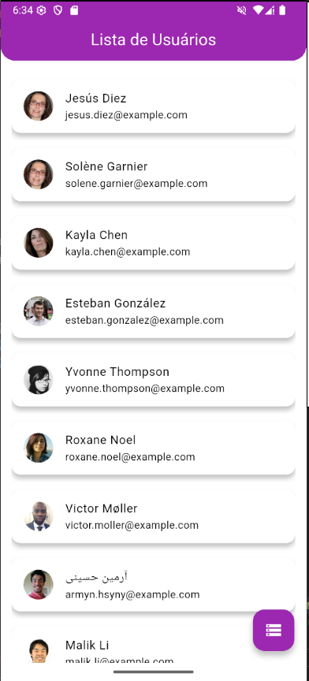
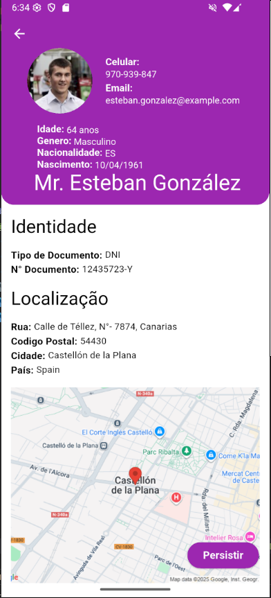
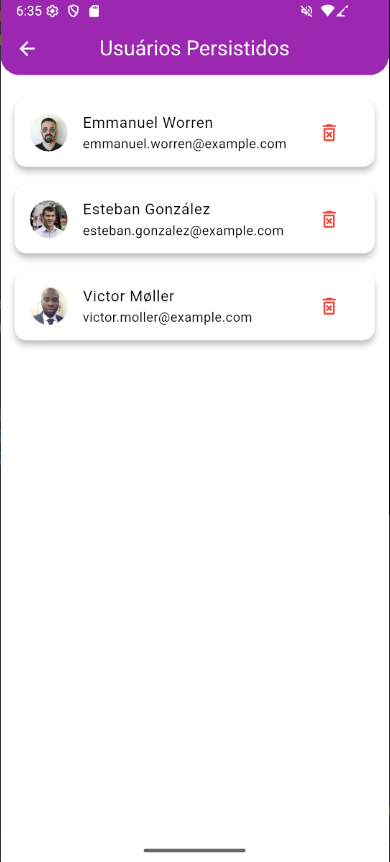

# Random User App


A modern Flutter application that consumes the Random User API to fetch and display random user profiles from around the world. The app features data persistence using Hive and ObjectBox, allowing users to save and manage their favorite profiles locally. Built with GetX for state management and supports multiple languages.

## 🌟 Features

- **API Consumption**: Fetch random user data from the Random User API
- **User Profiles**: Display detailed user information including name, email, location, login credentials, and more
- **Data Persistence**: Save favorite users locally using Hive and ObjectBox databases
- **Offline Support**: View persisted users even without internet connection
- **Multi-language Support**: Built-in translations (Portuguese BR as default)
- **Responsive Design**: Optimized for mobile devices with Material Design
- **Location Integration**: View user locations on Google Maps
- **Shimmer Loading**: Smooth loading animations for better UX
- **Error Handling**: Comprehensive error logging and user-friendly error messages

## 📱 Screenshots





## 🛠️ Prerequisites

Before running this project, make sure you have the following installed:

- **Flutter SDK**: Version 3.9.0 or higher
- **Dart SDK**: Version 3.9.0 or higher
- **Android Studio** or **VS Code** with Flutter extensions
- **Android SDK** (for Android development)
- **Xcode** (for iOS development on macOS)

### Installing Flutter

1. Download Flutter from the [official website](https://flutter.dev/docs/get-started/install)
2. Extract the zip file to a desired location
3. Add Flutter to your PATH
4. Run `flutter doctor` to check for any missing dependencies

## 🚀 Installation

1. **Clone the repository**:
   ```bash
   git clone https://github.com/your-username/api_consume_and_persistence.git
   cd api_consume_and_persistence
   ```

2. **Install dependencies**:
   ```bash
   flutter pub get
   ```

3. **Generate required files** (for code generation):
   ```bash
   flutter pub run build_runner build
   ```

4. **Configure icons and splash screen** (optional):
   ```bash
   flutter pub run icons_launcher:create
   flutter pub run flutter_native_splash:create
   ```

## ▶️ Running the App

### Development Mode

1. **Connect a device or start an emulator**:
   - For Android: Start Android Studio emulator or connect a physical device
   - For iOS: Start iOS Simulator (macOS only)

2. **Run the app**:
   ```bash
   flutter run
   ```

### Debug Mode

```bash
flutter run --debug
```

### Profile/Release Mode

```bash
flutter run --profile
flutter run --release
```

## 🏗️ Building the App

### Android APK

1. **Build APK**:
   ```bash
   flutter build apk --release
   ```

2. **Locate the APK**:
   The APK will be generated at `build/app/outputs/flutter-apk/app-release.apk`

### Android App Bundle (AAB)

```bash
flutter build appbundle --release
```

### iOS (macOS only)

1. **Build for iOS**:
   ```bash
   flutter build ios --release
   ```

2. **Open in Xcode**:
   ```bash
   open ios/Runner.xcworkspace
   ```

   Then archive and distribute through Xcode.

### Windows

```bash
flutter build windows --release
```

## 📁 Project Structure

```
lib/
├── domain/
│   ├── model/          # Data models with JSON serialization
│   ├── repositories/   # Repository pattern implementations
│   └── services/       # API services using Retrofit
├── presentation/
│   ├── controller/     # GetX controllers for state management
│   ├── screens/        # App screens/pages
│   └── widgets/        # Reusable UI components
├── translations/       # Multi-language support
├── util/               # Utilities and constants
├── locator.dart        # Dependency injection setup
├── main.dart           # App entry point
└── hive_registrar.g.dart # Hive adapter registrations
```

## 🏛️ Architecture

This app follows Clean Architecture principles:

- **Domain Layer**: Contains business logic, models, repositories, and services
- **Presentation Layer**: Handles UI, state management with GetX, and user interactions
- **Data Layer**: Manages API calls and local storage (Hive/ObjectBox)

### Key Technologies

- **State Management**: GetX
- **API Client**: Dio + Retrofit (type-safe HTTP client with automatic code generation)
- **Local Storage**: HiveCE
- **Serialization**: json_serializable
- **Dependency Injection**: GetX locator
- **UI Framework**: Flutter Material Design
- **Internationalization**: GetX translations

## 🔌 API Integration with Dio and Retrofit

This app leverages **Dio** as the HTTP client and **Retrofit** for type-safe API calls with automatic code generation.

### Dio Configuration

Dio is configured in the service layer with:
- Base URL setup for different APIs
- Error logging and handling
- Interceptors for request/response modification

### Retrofit Usage

Retrofit generates type-safe API clients from abstract classes:

Key features:
- **Automatic Code Generation**: `retrofit_generator` creates the implementation
- **Type Safety**: Strongly typed request/response models
- **Query Parameters**: Easy parameter injection with `@Query`
- **Multiple Endpoints**: Support for GET, POST, PUT, DELETE operations
- **Error Handling**: Built-in error parsing and logging

### API Services

- **UserApiService**: Fetches random user data from Random User API
- **GoogleLocationService**: Retrieves coordinates for user locations using Google Maps API

The generated code (`user_api_service.g.dart`, `google_location_service.g.dart`) handles all HTTP communication, JSON serialization, and error management automatically.

## 🔧 Configuration

### API Configuration

The app uses the Random User API. You can modify API settings in:
- `lib/domain/services/user_api_service.dart`
- `lib/util/app_constants.dart`

### Database Configuration

Local storage is configured in:
- `lib/main.dart` (Hive initialization)
- `lib/util/app_constants.dart` (Box names)

## 📦 Dependencies

### Main Dependencies
- `dio`: HTTP client for API calls
- `retrofit`: Type-safe HTTP client
- `get`: State management and routing
- `hive_ce`: Lightweight key-value database
- `intl`: Internationalization support

### Dev Dependencies
- `build_runner`: Code generation
- `retrofit_generator`: Generate API client code
- `json_serializable`: JSON serialization
- `hive_ce_generator`: Generate Hive adapters

## 🙏 Acknowledgments

- [Random User API](https://randomuser.me/) for providing user data
- [Flutter](https://flutter.dev/) for the amazing framework
- [GetX](https://pub.dev/packages/get) for state management
- [Hive](https://pub.dev/packages/hive_ce) for local storage

**Made with ❤️ using Flutter**
